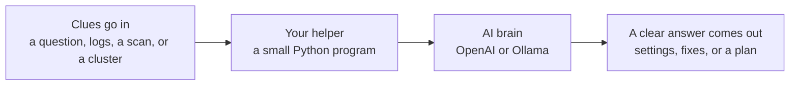

# AI Helpers for DevOps — A Beginner's Course

Welcome! This is a friendly, hands-on course for **complete beginners**.

You will build little **AI helpers** (called *agents*) that do real computer
jobs for you. You do not need any experience. If you can type and follow steps,
you can do this. We'll explain every new word in plain English as we go.

> **New to the scary words?** Keep the **[Word Helper (Glossary)](GLOSSARY.md)**
> open in another tab. It explains every term, simply.

---

## What You Will Learn

This course has **3 days** (we call them *sessions*), plus an optional
**Session 0** that teaches the coding basics first. Each one is short and
hands-on.

| Session | What you'll do | Cool words you'll learn |
|---------|----------------|--------------------------|
| **[Session 0](session0/README.md)** *(optional, start here if new to coding)* | Learn the three "languages" used in this course: Python, Bash, and Kubernetes YAML. | *Python, Bash, YAML* |
| **[Day 1](session1/README.md)** | Build your first AI helper. Make it write computer settings and read system logs to find problems. | *AI agent, logs, troubleshooting* |
| **[Day 2](session2/README.md)** | Use AI to spot **security** weak spots, and to find ways to **save money** in the cloud. | *DevSecOps, vulnerability, FinOps* |
| **[Day 3](session3/README.md)** | Break an app on purpose, then let your AI helper find the cause and suggest a safe fix. | *Kubernetes, pods, triage* |

By the end, you'll have built real AI helpers that work the way professionals
use them every day.

---

## What Is an "AI Agent," Really?

Imagine a very smart helper that has read a huge library of computer books.

You give it a job — like *"Look at these error messages and tell me what's
wrong."* It thinks about it and gives you an answer with steps to fix the
problem. That helper is an **AI agent**.

In this course, **you build the helpers** and put them to work on real tasks.

Every helper in this course follows the same simple pattern. Once you see it
once, you'll spot it in all three days:



> This diagram (and the ones in each day's lesson) show up automatically when you
> view the course on GitHub.

---

## Where This Is Used in the Real World

This course is small and friendly, but the **ideas** are exactly what big
companies use every day. Here's what each day maps to in the real world, and who
does it.

### Day 1 — Reading logs to fix problems (AIOps)

When a website slows down at 3 a.m., an on-call engineer reads through pages of
logs to find the cause. Today, AI helpers read those logs and suggest fixes in
seconds. This whole field is called **AIOps** (AI for IT Operations).

- **Tools that do this:** Datadog, Splunk, New Relic, Dynatrace, and PagerDuty
  all now include AI assistants that summarize incidents and suggest fixes.
- **Who uses it:** Almost every company that runs a website or app — from banks
  to streaming services — has an on-call team doing this kind of work.

### Day 2 (part 1) — Finding security weak spots (DevSecOps)

Before shipping software, teams scan it for security holes. A single app can have
hundreds, so AI helps decide which to fix **first**.

- **Tools that do this:** Trivy (the exact scanner we use) is made by **Aqua
  Security**. Others include GitHub's Dependabot and CodeQL, Snyk, Wiz, and Palo
  Alto's Prisma Cloud.
- **Who uses it:** Banks, hospitals, and any company handling personal data run
  scans like this — often it's required by law or industry rules.

### Day 2 (part 2) — Saving money in the cloud (FinOps)

Renting cloud computers is easy to overspend on. **FinOps** teams watch the bill
and cut waste, sometimes saving millions.

- **Tools that do this:** The exact data source we use, **AWS Cost Explorer**,
  plus Azure Cost Management, Google Cloud Billing, Apptio Cloudability, and
  CloudHealth. There's even a **FinOps Foundation** (part of the Linux Foundation)
  that sets best practices.
- **Who uses it:** Big cloud spenders like Netflix and Airbnb are famous for
  this, but any company with a growing cloud bill cares about it.

### Day 3 — Fixing broken apps in Kubernetes (SRE)

When a deployment breaks, **Site Reliability Engineers (SREs)** find the root
cause and roll back safely. AI now speeds up that hunt.

- **Where it started:** **SRE** was pioneered at **Google**, who also created
  **Kubernetes**. Companies like Spotify, Shopify, and Pinterest run Kubernetes
  at huge scale.
- **Tools that do this:** PagerDuty, Datadog, Robusta, and an open-source AI
  troubleshooter called **k8sgpt** — which is very close to the helper you build
  on Day 3.

> **The takeaway:** You're not learning a toy. You're learning the same ideas
> these companies use — just at a friendly, beginner scale.

---

## Quick Start (3 steps)

New here? The full, gentle walkthrough is in **[GUIDE.md](GUIDE.md)**. Here is
the short version:

```bash
# 1. Install the extra pieces our helpers need
pip install -r requirements.txt

# 2. Give your helper a brain. Pick ONE:
export OPENAI_API_KEY=sk-...      # use OpenAI's brain (needs a key)
# --- or ---
export AGENT_BACKEND=ollama       # use a free brain on your own computer

# 3. Do each day in order
cd session1 && ./run.sh           # Day 1
cd ../session2 && ./run.sh        # Day 2
cd ../session3 && ./run.sh        # Day 3   (run ./run.sh --cleanup when done)
```

Don't know what `pip` or `export` mean? That's okay — the
**[GUIDE.md](GUIDE.md)** explains each step slowly, and the
**[Glossary](GLOSSARY.md)** explains each word.

---

## What's Inside This Course

```text
agentic_ai_3_sessions/
├── README.md         ← you are here (course home)
├── GUIDE.md          ← step-by-step setup + how to run each day
├── GLOSSARY.md       ← plain-English meaning of every big word
├── BIO.md            ← about your instructor
├── requirements.txt  ← the list of extra pieces to install
├── session0/         ← (optional) Scripting Foundations: Python, Bash, YAML
├── session1/         ← Day 1 lesson + helpers
├── session2/         ← Day 2 lesson + helpers
└── session3/         ← Day 3 lesson + helpers
```

Each of the **Day 1-3** folders has:

- A **README.md** that explains the lesson in simple words.
- A **`run.sh`** "start button" that does the day's work for you.
- The helper programs (small `.py` files) you'll run.

**Session 0** is different: it's a read-through lesson (just a README) that
teaches the coding basics. There's nothing to run — it gets you ready to
understand the scripts in Days 1-3.

---

## Before You Start

You'll need a few free things on your computer. The **[GUIDE.md](GUIDE.md)**
shows how to get each one:

- **Python 3** — the language our helpers are written in.
- **An AI brain** — either an **OpenAI API key**, *or* **Ollama** (free, runs on your computer).
- *(Day 3 only)* **kubectl** and a Kubernetes cluster — for the container lesson.

Missing an optional tool? No problem. The scripts will simply **skip** that part
and tell you why, so nothing breaks.

---

## Tips for Beginners

- **Brand new to coding?** Read **[Session 0](session0/README.md)** first. It
  teaches Python, Bash, and YAML so the scripts make sense.
- **Go in order.** Day 1, then Day 2, then Day 3. Each builds on the last.
- **It's okay to get errors.** Read the message — it usually tells you what to fix.
- **Keep the [Glossary](GLOSSARY.md) handy.** Look up any word that feels strange.
- **Take your time.** This is not a race. Learning sticks better when it's slow.

---

## About Your Instructor

This course was made by **Emmanuel Naweji**, a DevOps, Cloud, and SRE engineer
who loves helping beginners get their first win. Read the full story in
**[BIO.md](BIO.md)**.

[LinkedIn](https://linkedin.com/in/ready2assist) | [GitHub](https://github.com/Here2ServeU)

---

Ready? Open **[GUIDE.md](GUIDE.md)** and let's begin. You've got this!
