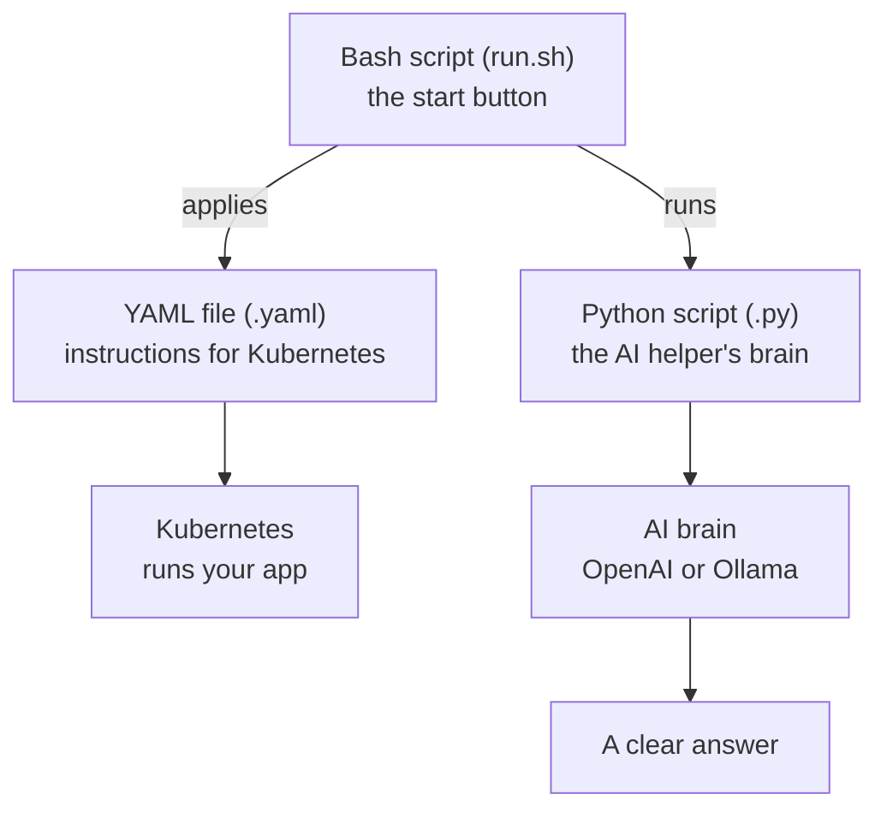

# Session 0 — Scripting Foundations (Python, Bash, and Kubernetes YAML)

New to coding? **Start here.** This session teaches the three "languages" used in
this whole course, in plain English, one small idea at a time. By the end, you
will be able to read **every** script in Sessions 1, 2, and 3 and understand what
each line does.

> See a word you don't know? The **[Word Helper (Glossary)](../GLOSSARY.md)**
> explains the big words too.

---

## What You'll Learn Today

This course uses three kinds of files. Here is what each one is for:

| Language | File ends in | We use it for |
|----------|--------------|---------------|
| **Python** | `.py` | The "brains" of our AI helpers |
| **Bash** (shell) | `.sh` | The "start buttons" that run the helpers |
| **YAML** | `.yaml` | Telling Kubernetes what app to run |

You do **not** need to memorize anything. Read it once, then come back like a
dictionary whenever a line in a real script looks confusing.

---

## How These Three Fit Together

Here is the big picture of how the three languages work as a team in this course:



- **Bash** is the helper that presses buttons for you: it checks your tools,
  installs pieces, and starts the Python programs.
- **Python** is where the real thinking happens: it gathers clues and talks to
  the AI.
- **YAML** is a list of instructions you hand to Kubernetes so it knows what app
  to run.

---

# Part 1 — Python (the brains)

Python is a friendly programming language. All five AI helpers in this course are
written in Python. Let's learn it by reading a **real** file from the course.

## 1A. A Guided Tour of a Real Script

Open **[../session1/agent_unified.py](../session1/agent_unified.py)**. We'll walk
through it from top to bottom. Here is the important part:

```python
#!/usr/bin/env python3
import os, subprocess
from openai import OpenAI

BACKEND = os.getenv("AGENT_BACKEND", "openai").lower()
OPENAI_API_KEY = os.getenv("OPENAI_API_KEY", "").strip()

def ask_llm(prompt: str) -> str:
    if BACKEND == "ollama":
        out = subprocess.run(["ollama", "run", "llama2", prompt], capture_output=True, text=True)
        return out.stdout.strip()
    client = OpenAI(api_key=OPENAI_API_KEY or None)
    r = client.chat.completions.create(
        model="gpt-4o-mini",
        messages=[{"role": "system", "content": "Helpful DevOps agent. Give exact commands."},
                  {"role": "user", "content": prompt}],
        temperature=0.2,
    )
    return r.choices[0].message.content

if __name__ == "__main__":
    print(ask_llm("Generate a Kubernetes Deployment for Express app on port 3000 with 2 replicas."))
```

Line by line:

1. `#!/usr/bin/env python3` — the **shebang**. It tells the computer "run this
   file with Python 3." It must be the very first line.
2. `import os, subprocess` — **import** brings in extra toolboxes. `os` lets us
   read settings from the computer; `subprocess` lets us run other programs.
3. `from openai import OpenAI` — a different way to import: it grabs just one tool
   (`OpenAI`) out of the `openai` toolbox.
4. `BACKEND = os.getenv("AGENT_BACKEND", "openai").lower()` — makes a **variable**
   named `BACKEND`. It reads the note you left with `export AGENT_BACKEND=...`. If
   the note is missing, it uses `"openai"` instead. `.lower()` makes the text all
   lowercase so `OpenAI` and `openai` both work.
5. `def ask_llm(prompt: str) -> str:` — defines a **function** (a reusable mini-
   program) named `ask_llm`. It takes one input called `prompt`. The `: str` and
   `-> str` are **hints** that say "this is text in, text out."
6. `if BACKEND == "ollama":` — a **decision**. `==` means "is equal to." If you
   chose Ollama, do the next lines; otherwise skip to the OpenAI part.
7. `subprocess.run([...])` — runs another program (here, Ollama). The answer
   comes back, and `.stdout.strip()` grabs the text and trims blank space.
8. `client.chat.completions.create(...)` — the line that actually asks OpenAI.
   `messages` is the conversation; `temperature=0.2` keeps answers steady.
9. `return ...` — sends the answer back to whoever called the function.
10. `if __name__ == "__main__":` — means "only run the next line if you start
    THIS file directly." It's the on/off switch for a script.
11. `print(...)` — shows the answer on the screen.

That's a whole AI helper! Every other Python file in this course is built from
these same pieces. Now let's name each idea so you'll recognize it everywhere.

## 1B. Python Concept Reference

Each idea below shows a tiny example and **where we use it in this course**.

### Comments and docstrings

A `#` starts a **comment** — a note for humans that the computer ignores. A
`""" ... """` at the top of a file is a **docstring** that explains what the file
does.

```python
# this is a comment
"""This is a docstring that explains the whole file."""
```

*Used in:* the top of every `.py` file, e.g. [../session2/agent_finops_aws.py](../session2/agent_finops_aws.py).

### Variables

A **variable** is a labeled box that holds a value.

```python
REGION = "us-east-1"   # text (a "string")
days = 7               # a number
```

*Used in:* `REGION`, `BACKEND`, `OPENAI_API_KEY` near the top of each helper.

### Reading environment variables

`os.getenv("NAME", "default")` reads a note you left with `export NAME=...`. The
second value is what to use if the note is missing.

```python
import os
backend = os.getenv("AGENT_BACKEND", "openai")
```

*Used in:* every helper, to pick OpenAI vs Ollama and to read your API key.

### String methods

Text is called a **string**. Strings have built-in helpers:

```python
"  Hello  ".strip()   # -> "Hello"   (trims spaces)
"OpenAI".lower()      # -> "openai"  (makes lowercase)
```

*Used in:* `.lower()` on the backend, `.strip()` on the API key and on command output.

### Functions

A **function** is a named, reusable block. You **call** it by name to run it.

```python
def add(a, b):
    return a + b

total = add(2, 3)   # total is now 5
```

*Used in:* `ask_llm()` (all helpers), `sh()`, `gather()`, `snapshot()`, `ce_last_7d()`.

### if / else decisions

`if` runs code only when something is true. `==` checks "equal to."

```python
if backend == "ollama":
    print("using Ollama")
else:
    print("using OpenAI")
```

*Used in:* every `ask_llm()` to choose which AI brain to use.

### Running other programs with subprocess

`subprocess.run(...)` lets Python run a command, then read what it printed.

```python
import subprocess
# Way 1: pass the command as a list of pieces
out = subprocess.run(["ollama", "run", "llama2", "hi"], capture_output=True, text=True)
print(out.stdout.strip())

# Way 2: pass one whole command line (shell=True)
result = subprocess.run("df -h", shell=True, text=True, capture_output=True)
```

- `capture_output=True` — keep the program's output instead of printing it.
- `text=True` — give us back normal text (not raw bytes).
- `.stdout` — the text the program printed. `.strip()` trims blank space.

*Used in:* the `sh()` helper in [../session1/agent_log_troubleshooter.py](../session1/agent_log_troubleshooter.py)
and [../session3/agent_k8s_triage.py](../session3/agent_k8s_triage.py), and in every Ollama branch.

### f-strings (putting values inside text)

Put an `f` before a string and you can drop variables inside `{ }`.

```python
name = "world"
print(f"hello {name}")        # -> hello world
print(f"command: {cmd!r}")    # !r adds quotes around the value, safely
```

*Used in:* building log reports (`f"## {l}\n{sh(c)}"`) and the Ollama command
(`f"ollama run llama2 {prompt!r}"`).

### Lists and tuples

A **list** is an ordered collection in square brackets `[ ]`. A **tuple** is like
a list but with round brackets `( )` and usually fixed.

```python
fruits = ["apple", "pear"]          # a list
pair = ("UPTIME", "uptime")         # a tuple (a label and a command)
```

*Used in:* the `cmds` list of `(label, command)` tuples in the log helper.

### List comprehensions

A short way to build a new list from an old one.

```python
nums = [1, 2, 3]
doubled = [n * 2 for n in nums]     # -> [2, 4, 6]
```

*Used in:* `[f"## {l}\n{sh(c)}" for l, c in cmds]` in the log helper, and the
nested one in [../session2/agent_finops_aws.py](../session2/agent_finops_aws.py)
that pulls service names and costs out of the AWS data.

### Joining strings

`"glue".join(list)` sticks a list of strings together with glue in between.

```python
"\n\n".join(["a", "b"])   # -> "a\n\nb"  (two new lines between)
```

*Used in:* `gather()` joins all the log sections into one big report.

### Dictionaries

A **dictionary** stores pairs of `key: value`, in curly braces `{ }`.

```python
person = {"name": "Sam", "role": "user"}
print(person["name"])     # -> Sam
```

*Used in:* the `messages` we send to the AI, like
`{"role": "system", "content": "..."}`.

### Reading values out of results

You reach inside lists with `[number]` and inside dictionaries with `["key"]`.

```python
r.choices[0].message.content      # the first choice's text
g["Metrics"]["UnblendedCost"]["Amount"]   # dig into nested data
```

*Used in:* every helper to pull the answer out of the AI's reply, and the FinOps
helper to read AWS cost numbers.

### Slicing (taking a piece)

`thing[:n]` takes the first `n` items of a list or characters of a string.

```python
"hello world"[:5]     # -> "hello"
[10, 20, 30, 40][:2]  # -> [10, 20]
```

*Used in:* `report[:15000]` (send only the first part of a big scan) and
`ce_last_7d()[:10]` (only the first 10 cost rows).

### Opening a file safely

`with open(...) as f:` opens a file and closes it for you when done.

```python
with open("trivy_nginx.json") as f:
    text = f.read()
```

*Used in:* [../session2/agent_devsecops_trivy.py](../session2/agent_devsecops_trivy.py)
to read the saved security scan.

### Turning data into text with JSON

`json.dumps(data, indent=2)` turns Python data into neat, readable text.

```python
import json
print(json.dumps({"a": 1, "b": 2}, indent=2))
```

*Used in:* `snapshot()` in the Kubernetes helper, to bundle the cluster facts.

### Dates

```python
import datetime
today = datetime.date.today()
week_ago = today - datetime.timedelta(days=7)
print(week_ago.isoformat())   # -> like "2026-05-15"
```

*Used in:* the FinOps helper, to ask AWS for the **last 7 days** of spending.

### The "main" switch and print

```python
if __name__ == "__main__":
    print("this only runs when you start the file directly")
```

*Used in:* the bottom of every helper, to kick things off.

---

# Part 2 — Bash (the start buttons)

Bash is the language of the **terminal**. The `run.sh` files are Bash scripts:
they check your tools, install pieces, and start the Python helpers — so you only
press one button.

## 2A. A Guided Tour of a Real Script

Open **[../session1/run.sh](../session1/run.sh)**. Here is the heart of it:

```bash
#!/usr/bin/env bash
set -euo pipefail
cd "$(dirname "$0")"

BACKEND="${AGENT_BACKEND:-openai}"

command -v python3 >/dev/null 2>&1 || { echo "ERROR: python3 is not installed."; exit 1; }

if [ "${BACKEND}" = "openai" ] && [ -z "${OPENAI_API_KEY:-}" ]; then
  echo "ERROR: OPENAI_API_KEY is not set."
  exit 1
fi

python3 -m pip install -q -r ../requirements.txt
python3 agent_unified.py
python3 agent_log_troubleshooter.py
```

Line by line:

1. `#!/usr/bin/env bash` — the **shebang**, like in Python, but it says "run this
   with Bash."
2. `set -euo pipefail` — turns on **safety mode** (explained just below).
3. `cd "$(dirname "$0")"` — moves into the folder where this script lives, so it
   works no matter where you run it from.
4. `BACKEND="${AGENT_BACKEND:-openai}"` — makes a variable. The `:-openai` part
   means "use `openai` if the note isn't set."
5. `command -v python3 ...` — checks that Python is installed. If not, it prints
   an error and stops.
6. `if [ ... ]; then ... fi` — a decision, just like Python's `if`.
7. `python3 -m pip install ...` — installs the needed pieces.
8. `python3 agent_unified.py` — runs the Python helper.

## 2B. Bash Concept Reference

### Comments

A `#` starts a comment (same as Python).

```bash
# this line is just a note
```

### Safety mode: set -euo pipefail

This one line stops the script the moment something goes wrong, instead of
charging ahead and making a mess.

- `-e` — **e**xit right away if any command fails.
- `-u` — error if you use a variable that was never set (catches typos).
- `-o pipefail` — if any step in a `a | b` pipe fails, the whole line counts as
  failed.

*Used in:* the top of all three `run.sh` files.

### Variables and quotes

In Bash, set a variable with **no spaces** around the `=`. Read it with `$`.
Always wrap it in double quotes when you use it.

```bash
name="Sam"
echo "hello ${name}"
```

*Used in:* `BACKEND`, and reading `"${OPENAI_API_KEY:-}"`.

### Defaults with ${VAR:-something}

`${VAR:-default}` means "use `VAR`, but if it's empty or unset, use `default`."
Writing `${VAR:-}` (with nothing after) safely turns an unset variable into an
empty value — important under `set -u`.

```bash
backend="${AGENT_BACKEND:-openai}"   # default to openai
key="${OPENAI_API_KEY:-}"            # safely allow it to be empty
```

*Used in:* every `run.sh`.

### Command substitution: $( ... )

`$( ... )` runs a command and drops its output right into your line.

```bash
cd "$(dirname "$0")"   # $0 is this script's path; dirname gives its folder
echo "today is $(date)"
```

*Used in:* the `cd "$(dirname "$0")"` line in every `run.sh`.

### Checking things with tests: [ ... ]

`[ ... ]` is a **test**. It's true or false. Common checks:

- `[ "$a" = "$b" ]` — are two pieces of text equal?
- `[ -z "$x" ]` — is `x` empty?
- `[ -f file.txt ]` — does this file exist?

```bash
if [ -z "${OPENAI_API_KEY:-}" ]; then
  echo "the key is empty"
fi
```

*Used in:* checking the backend and whether the API key is set; and `[ -f trivy_nginx.json ]`
in [../session2/run.sh](../session2/run.sh).

### Combining: && , || , and { ; }

- `A && B` — run `B` only if `A` succeeded.
- `A || B` — run `B` only if `A` failed.
- `{ cmd1; cmd2; }` — group commands together.

```bash
command -v python3 >/dev/null 2>&1 || { echo "no python3"; exit 1; }
```

That reads: "check for python3; **or else** print an error and exit."

*Used in:* the tool checks at the top of every `run.sh`.

### Redirects: >/dev/null and 2>&1

Programs print to two places: normal output (1) and errors (2).

- `>/dev/null` — throw away normal output (we only care if it worked).
- `2>&1` — send errors to the same place as normal output.

```bash
command -v kubectl >/dev/null 2>&1   # quietly check if kubectl exists
```

*Used in:* the quiet tool checks in every `run.sh`.

### Pipes and || true

A pipe `|` feeds one command's output into the next. Adding `|| true` at the end
means "don't fail even if this part has nothing to show."

```bash
kubectl get pods -A | egrep 'Error' || true
```

*Used in:* gathering broken pods (Session 3) and trimming logs with `tail`.

### Positional parameters: $1, $0

`$0` is the script's name. `$1` is the first thing you typed after it. `${1:-}`
safely defaults it to empty.

```bash
if [ "${1:-}" = "--cleanup" ]; then
  echo "cleaning up..."
fi
```

*Used in:* [../session3/run.sh](../session3/run.sh) — running `./run.sh --cleanup`
removes the broken app.

### exit codes

`exit 0` means success; `exit 1` (or any non-zero) means "something went wrong."
Bash uses these to decide what to do next.

*Used in:* `exit 1` after every error message in the `run.sh` files.

---

# Part 3 — YAML for Kubernetes (the instructions)

YAML is a simple way to write settings and instructions. Kubernetes reads YAML
files to learn what app you want it to run.

## 3A. The Rules of YAML

YAML is mostly just `key: value` pairs. A few rules:

- Use **spaces** to show what belongs inside what. **Never use the Tab key** —
  YAML hates tabs.
- The amount of space (indentation) matters. Lines indented under a key belong to
  that key.
- A line starting with `-` is an **item in a list**.
- A `#` starts a comment.

```yaml
name: Sam            # a key and a value
hobbies:             # a key whose value is a list
  - reading
  - hiking
address:             # a key whose value is more keys
  city: Denver
  zip: "80202"
```

## 3B. A Guided Tour of a Real Kubernetes File

Open **[../session3/bad-deploy.yaml](../session3/bad-deploy.yaml)**. This is the
file we break on purpose in Session 3:

```yaml
apiVersion: apps/v1
kind: Deployment
metadata:
  name: bad-api
  namespace: default
spec:
  replicas: 1
  selector:
    matchLabels:
      app: bad-api
  template:
    metadata:
      labels:
        app: bad-api
    spec:
      containers:
      - name: app
        image: nginx:0.0   # invalid tag to trigger ImagePullBackOff
        ports:
        - containerPort: 80
```

Here's what every part means:

- `apiVersion: apps/v1` — which version of the Kubernetes rules this file uses.
  Deployments live under `apps/v1`.
- `kind: Deployment` — **what** we're making. A **Deployment** says "keep this
  many copies of my app running."
- `metadata:` — labels and names for this object.
  - `name: bad-api` — the name of our Deployment.
  - `namespace: default` — which "room" in the cluster it lives in.
- `spec:` — the **spec**ification: the actual wishes.
  - `replicas: 1` — run **one** copy of the app.
  - `selector.matchLabels.app: bad-api` — "the pods I manage are the ones tagged
    `app: bad-api`."
  - `template:` — the blueprint for each pod (copy) it makes.
    - `metadata.labels.app: bad-api` — tags each pod. **This must match the
      selector above**, or Kubernetes gets confused about which pods are its own.
    - `spec.containers:` — the list of containers in the pod.
      - `- name: app` — the container's name (the `-` means it's a list item).
      - `image: nginx:0.0` — **the broken part on purpose.** There is no real
        `nginx` image tagged `0.0`, so Kubernetes can't download it and shows
        the error **ImagePullBackOff**.
      - `ports.containerPort: 80` — the app listens on port 80.

### How Kubernetes uses this file

You hand the file to Kubernetes with `kubectl`:

```bash
kubectl apply -f bad-deploy.yaml    # start it
kubectl delete -f bad-deploy.yaml   # remove it
```

- `kubectl` — the command tool that talks to Kubernetes.
- `apply -f` — "read this **f**ile and make the cluster match it."
- `delete -f` — "remove what this file describes."

*Used in:* [../session3/run.sh](../session3/run.sh), which applies the file and
later deletes it with `--cleanup`.

---

## You're Ready

That's the whole toolkit. Every script in this course is built from the ideas on
this page:

- **Python** gathers clues and talks to the AI.
- **Bash** presses the buttons and checks your tools.
- **YAML** tells Kubernetes what to run.

When a line looks strange in Session 1, 2, or 3, come back here and find it. Now
head to **[Session 1](../session1/README.md)** and put it to work.

---

*Made by Emmanuel Naweji — read his story in [BIO.md](../BIO.md).*
[LinkedIn](https://linkedin.com/in/ready2assist) | [GitHub](https://github.com/Here2ServeU)
