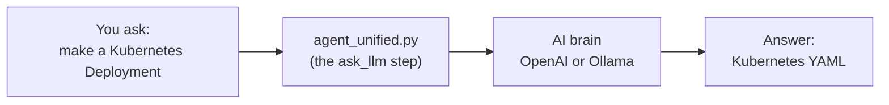

# Day 1 — Your First AI Helper + Reading Logs

Welcome to Day 1! Today you build your **very first AI helper**. By the end,
you'll have made a helper that writes computer settings, and another that reads a
computer's "diary" to find problems.

> New words ahead? The **[Word Helper (Glossary)](../GLOSSARY.md)** explains them all.

---

## What You'll Do Today

1. Run your **first AI helper** (`agent_unified.py`). It writes a Kubernetes
   settings file for you.
2. Build a **log-reading helper** (`agent_log_troubleshooter.py`). It reads your
   computer's logs and tells you what looks wrong.

Think of these helpers like smart interns. You give them a task, and they do the
boring reading and thinking, then hand you the answer.

---

## How It Works (The Big Picture)

Both of today's helpers follow the same simple path: **something goes in, the
helper sends it to an AI brain, and an answer comes out.** (These pictures show
up automatically on GitHub.)

**Helper 1 — `agent_unified.py`** writes a settings file for you:



**Helper 2 — `agent_log_troubleshooter.py`** finds problems in your logs:


---

## What You Need First

You only need a couple of things. The **[GUIDE.md](../GUIDE.md)** shows how to get each one.

| You need... | Why | Where to get it |
|-------------|-----|-----------------|
| **Python 3** | runs the helpers | <https://www.python.org/downloads/> |
| **An AI brain** | so the helper can think | OpenAI key, *or* free Ollama: <https://ollama.com> |
| **Git** *(to download the course)* | copies the project to your computer | <https://git-scm.com/downloads> |

> The other tools you may have heard of (Terraform, AWS CLI) are **not** needed
> for Day 1. We'll meet some of them later.

---

## The Easy Way to Run Day 1

The simplest path is the "start button." From the `session1` folder, type:

```bash
./run.sh
```

That one command checks your tools, installs the pieces, and runs both helpers
in order. If you'd rather run them yourself, see "The Manual Way" below.

---

## Helper 1: `agent_unified.py` — Write Kubernetes Settings

**What it does:** You ask the AI for a Kubernetes *Deployment* (the file that
says "keep my app running"), and it writes one for you.

**How it works, step by step:**

1. It loads a few tools it needs (built into Python).
2. It checks which AI brain you picked — OpenAI or Ollama.
3. It has a small function called `ask_llm` whose only job is to send your
   question to the AI and bring back the answer (like a waiter taking your
   order to the kitchen).
4. If you picked OpenAI, it sends the question over the internet and reads the reply.
5. If you picked Ollama, it asks the AI brain running on your own computer instead.

The question it asks is:

> *"Generate a Kubernetes Deployment for an Express app on port 3000 with 2 replicas."*

In plain words: *"Write me the settings to run my web app, and keep 2 copies of
it alive."* The AI writes that file for you.

---

## Helper 2: `agent_log_troubleshooter.py` — Find Problems in Logs

**What it does:** Your computer keeps *logs* — a diary of what happened,
including errors. This helper gathers that diary and asks the AI, "What's wrong,
and how do I fix it?" It's like a doctor reading your symptoms.

**How it works, step by step:**

1. It loads its tools.
2. It has a tiny helper called `sh()` that runs a command and grabs the result.
3. It has a function called `gather()` that collects facts about your computer:
   - How full the disk is
   - How much memory is used
   - How long it's been on
   - Recent errors and warnings from the system logs
4. It sends all of that to the AI using `ask_llm()`.
5. The AI prints back a **Summary**, the **Top Findings**, and the **exact
   commands** to fix the issues.

> This is exactly how real engineers use AI — feed it the clues, get back a
> diagnosis and a fix.

---

## The Manual Way (run each helper yourself)

Prefer to type the commands yourself? Here's how.

**Step 1 — Get the course (if you haven't yet):**

```bash
git clone https://github.com/Here2ServeU/agentic_ai_3_sessions.git
cd agentic_ai_3_sessions/session1
```

**Step 2 — Give your helper a brain.** Pick ONE:

```bash
export OPENAI_API_KEY=your_openai_api_key   # OpenAI
# --- or ---
export AGENT_BACKEND=ollama                 # free, on your computer
```

**Step 3 — Run the helpers:**

```bash
python3 agent_unified.py
python3 agent_log_troubleshooter.py
```

You can switch brains any time by changing the `AGENT_BACKEND` note. No code
changes needed. 

---

## Optional Bonus: Make a Real Server with Terraform

Want to try something extra? **Terraform** is a tool that builds cloud servers
from a text file. This is optional and **not** required for the lesson — skip it
if you're just getting started.

Create a file named `main.tf` with this inside:

```hcl
provider "aws" {
  region = "us-east-1"
}

resource "aws_instance" "devops_instance" {
  ami           = "ami-0aa7d40eeae50c9a9" # Amazon Linux 2 AMI
  instance_type = "t2.micro"
  key_name      = "your-ec2-key-pair"

  tags = {
    Name = "DevOps-Instance"
  }
}
```

- Replace `"your-ec2-key-pair"` with the name of your AWS key pair.
- Run `terraform init` to get ready.
- Run `terraform apply` to build the server.

**Clean up when done** so you don't pay for a server you're not using:

```bash
terraform destroy -auto-approve
```

---

## Day 1 Done

Great job — you just built and ran your first AI helpers! When you're ready,
head to **[Day 2](../session2/README.md)** to use AI for security and saving money.

---

*Made by Emmanuel Naweji — read his story in [BIO.md](../BIO.md).*
[LinkedIn](https://linkedin.com/in/ready2assist) | [GitHub](https://github.com/Here2ServeU)
