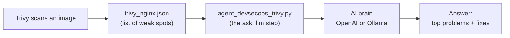
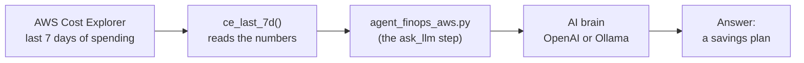

# Day 2 — Security Check + Saving Money

Welcome to Day 2! Today your AI helpers do two grown-up jobs:

1. **Find security weak spots** in a container (this is called *DevSecOps*).
2. **Find ways to spend less** on your cloud bill (this is called *FinOps*).

> New words ahead? The **[Word Helper (Glossary)](../GLOSSARY.md)** explains them all.

---

## What You'll Do Today

- Scan a container image with **Trivy** (a free safety scanner).
- Use AI (`agent_devsecops_trivy.py`) to read the scan and say which problems to
  fix **first**.
- Use AI (`agent_finops_aws.py`) to look at your cloud spending and suggest **savings**.

Think of it like a home inspection: one helper checks for unlocked doors
(security), and the other checks for lights left on that waste money (cost).

---

## How It Works (The Big Picture)

Both helpers follow the same path you saw on Day 1: **clues go in, the AI brain
thinks, and a clear answer comes out.** (These pictures show up automatically on
GitHub.)

**Helper 1 — `agent_devsecops_trivy.py`** (security):



**Helper 2 — `agent_finops_aws.py`** (saving money):



---

## What You Need First

| You need... | Why | Required? |
|-------------|-----|-----------|
| **Python 3** + an AI brain | runs the helpers | Yes |
| **Trivy** | makes the security scan file | Optional |
| **AWS login** (`aws configure`) | lets the helper read your cloud bill | Optional |

> Missing Trivy or AWS? No problem! Those parts get **skipped** with a friendly
> message. Day 2 will not fail. You can still learn from the part that runs.

---

## The Easy Way to Run Day 2

From the `session2` folder, type:

```bash
./run.sh
```

It installs the pieces, makes a security scan (if Trivy is installed), runs the
security helper, and then — if it finds AWS login info — runs the money helper.

---

## Helper 1: `agent_devsecops_trivy.py` — Prioritize Security Fixes

**What it does:** A scanner like Trivy can find *hundreds* of weak spots
(*vulnerabilities*) in a single image. That's overwhelming! This helper reads the
scan and asks the AI, "Which ones matter most, and how do I fix them?"

**How it works, step by step:**

1. It loads its tools.
2. It has a function `ask_llm()` whose job is to send a question to the AI
   (OpenAI or Ollama) and bring back the answer.
3. It opens the saved scan file, `trivy_nginx.json`.
4. It sends that scan to the AI and asks for a short summary plus fix steps.

The AI hands you a **prioritized list** — the scary stuff first, with how to fix
each one. That turns a giant scary report into a clear to-do list.

> **Need a scan file?** If you have Trivy installed, make one like this:
>
> ```bash
> trivy image --format json --output trivy_nginx.json nginx:latest
> ```

---

## Helper 2: `agent_finops_aws.py` — Find Cloud Savings

**What it does:** This helper looks at how much money you spent in the cloud over
the last week, then asks the AI for smart ways to spend less.

**How it works, step by step:**

1. It loads `boto3` — the tool Python uses to talk to AWS.
2. A function called `ce_last_7d()` asks AWS Cost Explorer, "How much did I spend
   in the last 7 days, broken down by service?"
3. It sends those numbers to the AI with `ask_llm()`.
4. The AI gives back a **savings plan** — ideas like using smaller servers
   (rightsizing), cheaper "Spot" servers, or Savings Plans.

> This needs working AWS login info. If you don't have it, the helper is skipped —
> that's fine for now.

---

## The Manual Way (run each helper yourself)

```bash
cd agentic_ai_3_sessions/session2

# Give your helper a brain (pick ONE):
export OPENAI_API_KEY=your_openai_api_key   # OpenAI
# --- or ---
export AGENT_BACKEND=ollama                 # free, on your computer

# Run the security helper (needs a trivy_nginx.json file):
python3 agent_devsecops_trivy.py

# Run the money helper (needs AWS login):
python3 agent_finops_aws.py
```

---

## Day 2 Done

Nicely done! You used AI to keep systems **safe** and to **save money** — two
things every company cares about. Next up: **[Day 3](../session3/README.md)**,
where you fix a broken app.

---

*Made by Emmanuel Naweji — read his story in [BIO.md](../BIO.md).*
[LinkedIn](https://linkedin.com/in/ready2assist) | [GitHub](https://github.com/Here2ServeU)
