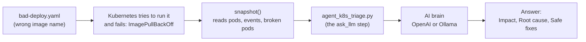

# Day 3 — Fixing a Broken App (Kubernetes)

Welcome to Day 3 — the finale! Today you'll break an app **on purpose**, then
let your AI helper play detective: find the cause and suggest a safe fix. This is
exactly what on-call engineers do when something goes down at 2 a.m.

> New words ahead? The **[Word Helper (Glossary)](../GLOSSARY.md)** explains them all.

---

## What You'll Do Today

1. Start a broken app (`bad-deploy.yaml`) in **Kubernetes** (the manager that
   runs containers).
2. Let `agent_k8s_triage.py` take a snapshot of the cluster.
3. Read the AI's report: what broke, **why**, and how to fix it safely.

---

## A Quick Picture of Kubernetes

Imagine a busy restaurant. **Kubernetes** is the manager. The **containers** are
the cooks. The manager makes sure the right number of cooks are working, and if a
cook quits, it hires a new one right away.

Today, we'll give the manager a cook that doesn't exist (a typo in the name). The
manager will keep trying to find that cook and fail. That failure is called
**ImagePullBackOff** — and our AI helper will figure out what went wrong.

---

## How It Works (The Big Picture)

Today there is one helper. It follows the same path as the other days: **clues go
in, the AI brain thinks, and a clear answer comes out.** (This picture shows up
automatically on GitHub.)



---

## What You Need First

| You need... | Why |
|-------------|-----|
| **Python 3** + an AI brain | runs the helper |
| **kubectl** + a running cluster | starts and inspects the app |

> No cluster yet? You can run one for free on your own computer with tools like
> **Minikube** or **kind**. The helper needs a cluster it can reach.

---

## The Easy Way to Run Day 3

From the `session3` folder:

```bash
./run.sh            # break the app + run the AI helper
./run.sh --cleanup  # remove the broken app when you're finished
```

> **Always run the cleanup line when you're done.** It removes the broken app
> so it doesn't keep trying forever in the background.

---

## File 1: `bad-deploy.yaml` — The App We Break on Purpose

**What it does:** This file tells Kubernetes to run an app — but it uses a
**fake image name** (`nginx:0.0`), which does not exist.

**Why we do this:**

- Kubernetes tries to download (`pull`) the image `nginx:0.0`.
- It can't find it, so it shows the error **ImagePullBackOff**.
- That gives us a real, safe problem to practice fixing.

It's like asking the restaurant manager to hire a cook named "nobody." The
manager keeps looking and never finds them.

---

## File 2: `agent_k8s_triage.py` — The AI Detective

**What it does:** This helper looks at your whole cluster, gathers the clues, and
asks the AI to explain the problem and the fix.

**How it works, step by step:**

1. It loads its tools (`os`, `subprocess`, `json`, and the AI library).
2. It has a tiny helper `sh()` that runs a command and grabs the result.
3. It has a function `snapshot()` that collects the clues:
   - The status of all pods (which are running, which are broken)
   - Recent cluster events (what just happened)
   - The list of broken pods (like the ones stuck in `ImagePullBackOff`)
4. It sends those clues to the AI with `ask_llm()`.
5. The AI replies with:
   - **Impact** — who/what is affected
   - **Root cause** — the real reason it broke
   - **Safe fixes** — the exact commands, like `kubectl set image` or a rollback

> Notice the pattern across all 3 days: **gather the clues → ask the AI →
> get a clear answer.** That's the heart of an AI agent.

---

## The Manual Way (run it yourself)

```bash
cd agentic_ai_3_sessions/session3

# Give your helper a brain (pick ONE):
export OPENAI_API_KEY=your_openai_api_key   # OpenAI
# --- or ---
export AGENT_BACKEND=ollama                 # free, on your computer

# Start the broken app:
kubectl apply -f bad-deploy.yaml

# Run the AI detective:
python3 agent_k8s_triage.py

# When you're done, remove the broken app:
kubectl delete -f bad-deploy.yaml --ignore-not-found
```

---

## You Finished the Course

Amazing work! Over three days you built AI helpers that:

- Write configuration and read system logs (Day 1)
- Catch security weak spots and find cloud savings (Day 2)
- Diagnose and fix broken apps in Kubernetes (Day 3)

You went from "what is an AI agent?" to building real ones. Be proud of that.

**Next steps:** try changing the questions the helpers ask, point them at your own
systems, and keep experimenting. That's how the pros got good — one small project
at a time.

---

*Made by Emmanuel Naweji — read his story in [BIO.md](../BIO.md).*
[LinkedIn](https://linkedin.com/in/ready2assist) | [GitHub](https://github.com/Here2ServeU)
